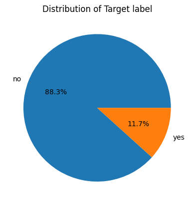
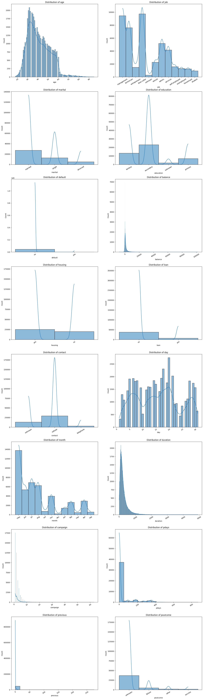
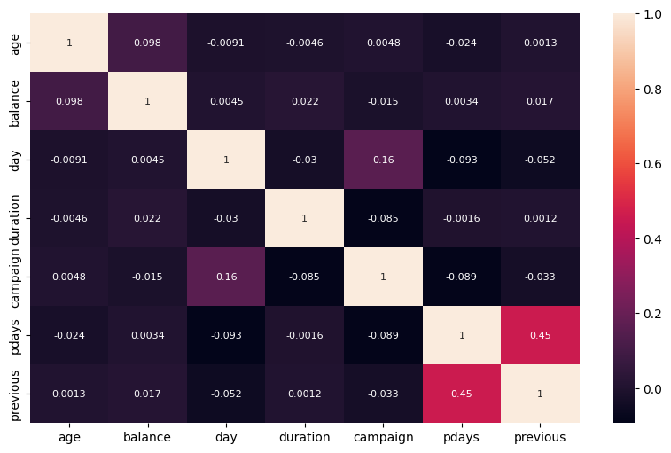
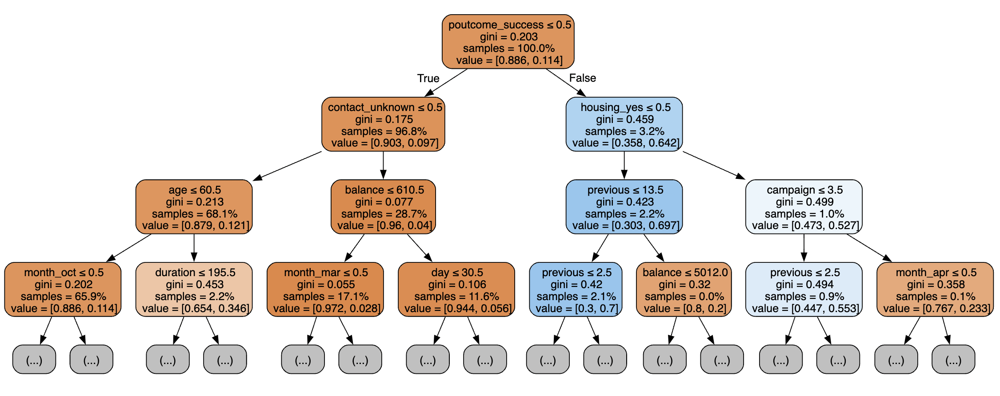

# Random Forest Classifier with Model Evaluation and Feature Importance

This repository contains a Python notebook that demonstrates the use of a Random Forest classifier for a supervised learning problem. The notebook includes training the model, evaluating its performance using multiple metrics, and exploring feature importance.

## Connect with Me

- **LinkedIn:** [https://www.linkedin.com/in/mahshidkhatami-data-analyst/](https://www.linkedin.com/in/mahshidkhatami-data-analyst/)
- **Email:** [khatami.mahshid@gmail.com](mailto:khatami.mahshid@gmail.com)


## Table of Contents

- [Project Overview](#project-overview)
- [Sample Data](#Sample_Data)
- [Usage](#usage)
- [Model Evaluation](#model-evaluation)
- [Feature Importance](#feature-importance)
- [Dependencies](#dependencies)


## Project Overview
This project focuses on training a Random Forest classifier on a dataset. The key steps include:

1. **Training the model:** We use the Random Forest algorithm to fit the model to the training data.
2. **Evaluating the model:** Predictions are generated using the test set, and various metrics are calculated to assess the model's performance.
3. **Feature Importance:** The notebook also highlights the most important features based on the trained model.


## Sample Data

Below is a sample of the dataset used in this project:

| age | job         | marital  | education | default | balance | housing | loan | contact  | day | month | duration | campaign | pdays | previous | poutcome | y  |
|-----|-------------|----------|-----------|---------|---------|---------|------|----------|-----|-------|----------|----------|-------|----------|----------|----|
| 58  | management  | married  | tertiary  | no      | 2143    | yes     | no   | unknown  | 5   | may   | 261      | 1        | -1    | 0        | unknown  | no |
| 44  | technician  | single   | secondary | no      | 29      | yes     | no   | unknown  | 5   | may   | 151      | 1        | -1    | 0        | unknown  | no |
| 33  | entrepreneur| married  | secondary | no      | 2       | yes     | yes  | unknown  | 5   | may   | 76       | 1        | -1    | 0        | unknown  | no |
| 47  | blue-collar | married  | unknown   | no      | 1506    | yes     | no   | unknown  | 5   | may   | 92       | 1        | -1    | 0        | unknown  | no |
| 33  | unknown     | single   | unknown   | no      | 1       | no      | no   | unknown  | 5   | may   | 198      | 1        | -1    | 0        | unknown  | no |

This table displays key features such as age, job, marital status, education level, and financial information (e.g., balance, loan, and housing).

## Usage
This is the Distribution of Target:



So 88.3% of target value has the value of NO and other are Yes

and here is the Distribution of all features:



and here is the correlation matrix of the features:




Each tree image is limited to only showing the first few nodes. These trees can get very large and difficult to visualize. The colors represent the majority class of each node (box, with red indicating majority 0 (no subscription) and blue indicating majority 1 (subscription). The colors get darker the closer the node gets to being fully 0 or 1. Each node also contains the following information:

- The variable name and value used for splitting
- The % of total samples in each split
- The % split between classes in each split


## Model Evaluation
The model's performance is evaluated using the following metrics:

- **Accuracy:** The overall correctness of the model.
- **Precision:** The ability of the classifier to not label a negative sample as positive.
- **Recall:** The ability of the classifier to find all the positive samples.

## Feature Importance
You can understand which features contribute the most to the predictions made by the Random Forest model with this code:

```
importances = rf.feature_importances_
indices = np.argsort(importances)[::-1]
```

## Dependencies
The main libraries used in this project include:

- **scikit-learn:** For machine learning algorithms and model evaluation
- **matplotlib:** For visualizing feature importance
- **graphviz:** For visualizing decision trees
- **numpy:** For numerical operations

Install these dependencies using:

```
pip install -r requirements.txt
```